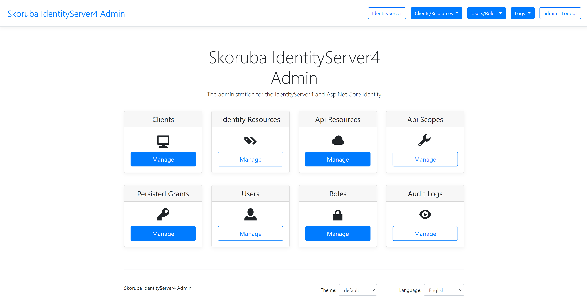
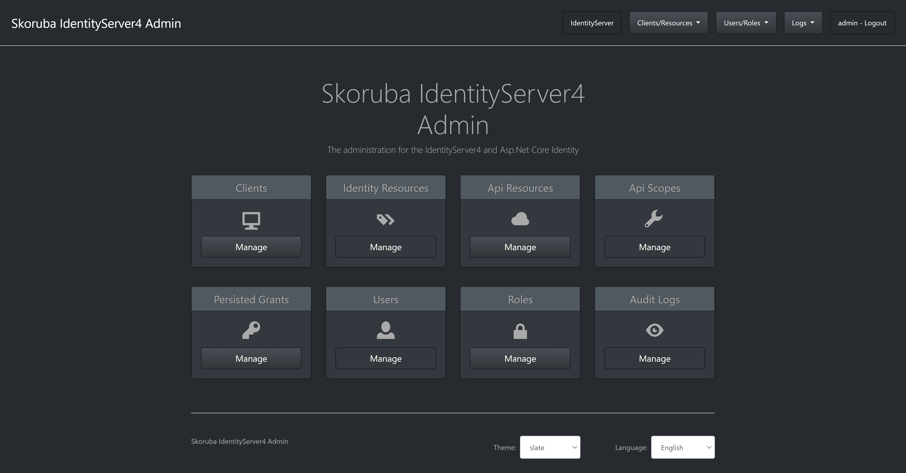
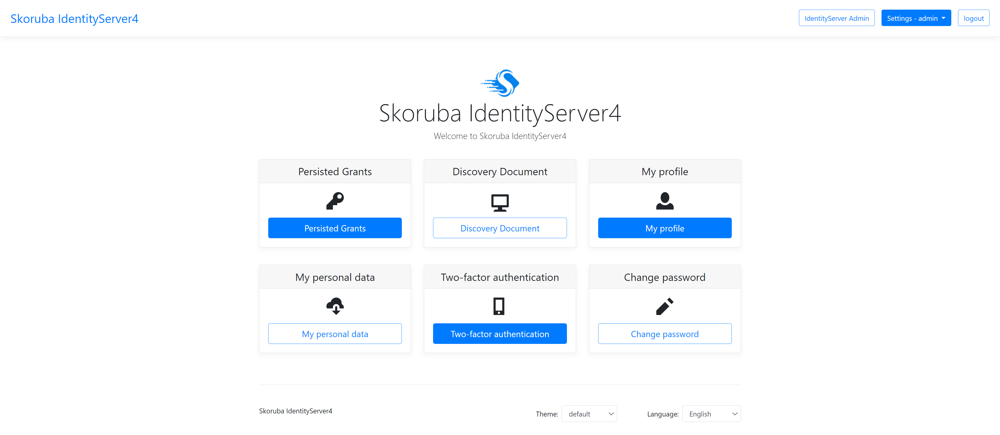
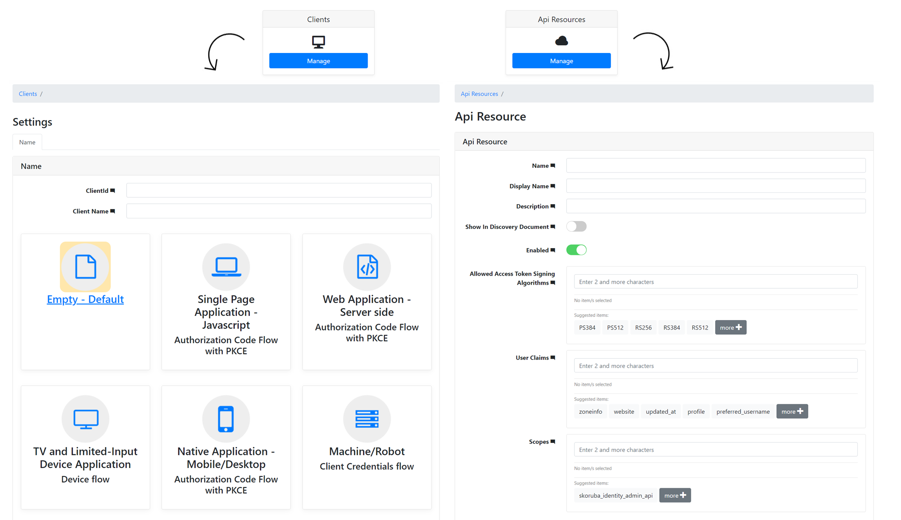
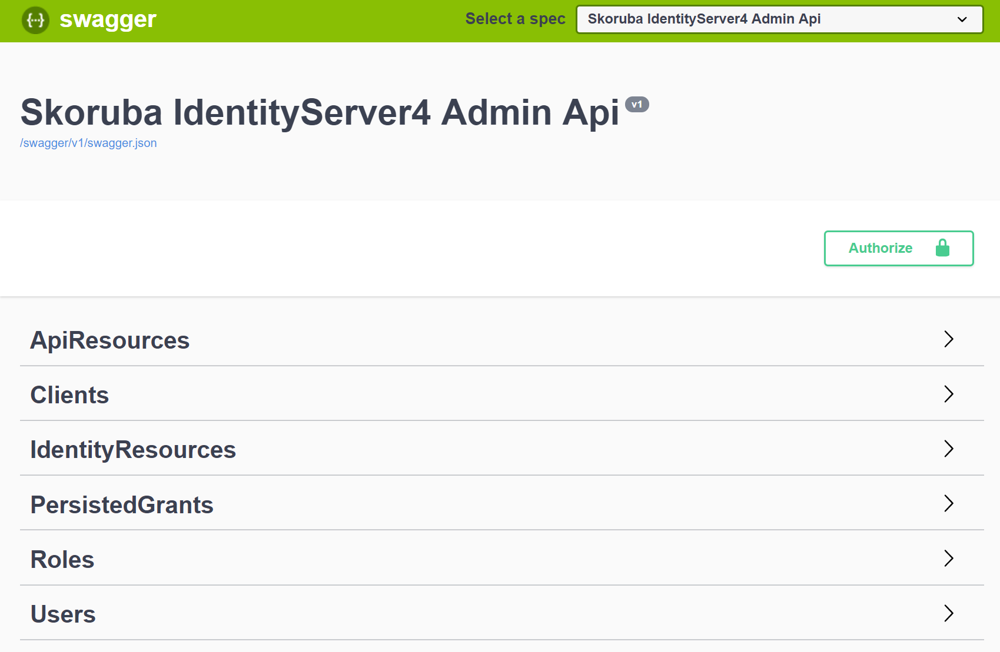
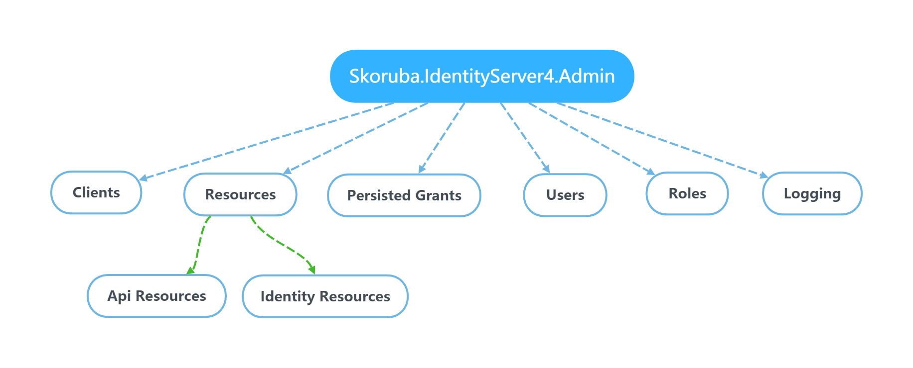
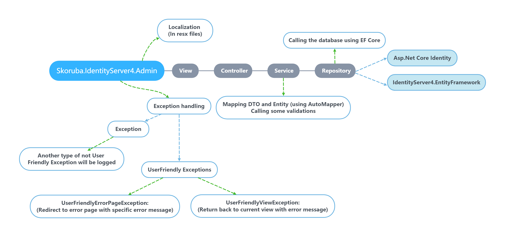

# Reborn.IdentityServer4.Admin

> The administration for the IdentityServer4 and Asp.Net Core Identity

## Project Status

[](https://ci.appveyor.com/project/JanSkoruba/identityserver4-admin/branch/master)
[](https://gitter.im/skoruba/IdentityServer4.Admin?utm_source=badge&utm_medium=badge&utm_campaign=pr-badge&utm_content=badge)

The application is written in the **Asp.Net Core MVC - using .NET 8**

## Requirements

- [Install](https://www.microsoft.com/net/download/windows#/current) the latest .NET 8 SDK 

## How to configure the Administration - IdentityServer4 and Asp.Net Core Identity

- [Follow these steps for setup project to use existing IdentityServer4 and Asp.Net Core Identity](docs/Configure-Administration.md)

### Template uses following list of nuget packages

- [Available nuget packages](https://www.nuget.org/profiles/skoruba)

### Running in Visual Studio

- Set Startup projects:
  - Reborn.IdentityServer4.Admin
  - Reborn.IdentityServer4.Admin.Api
  - Reborn.IdentityServer4.STS.Identity

## Configuration of Administration for Deployment

- [Configuration of Admin on Ubuntu with PostgreSQL database](docs/Configure-Ubuntu-PostgreSQL-Tutorial.md)

## Administration UI preview

- This administration uses bootstrap 4

### Admin UI - Light mode 🌞



### Admin UI - Dark mode 🌙



### Security token service (STS)



### Forms



## Cloning

```sh
git clone https://github.com/iamshen/Reborn.IdentityServer4.Admin
```


### Docker setup

### DNS

We need some resolving capabilities in order for the project to work. The domain `skoruba.local` is used here to represent the domain this setup is hosted on. The domain-name needs to be FQDN (fully qualified domain name).

Thus first, we need the domain `skoruba.local` to resolve to the docker-host machine. If you want this to work on your local machine only, use the first option.

#### DNS on docker-host machine only

Edit your hosts file:

- On Linux: `\etc\hosts` 
- On Windows: `C:\Windows\system32\drivers\etc\hosts` 

 and add the following entries:

```custom
127.0.0.1 skoruba.local sts.skoruba.local admin.skoruba.local admin-api.skoruba.local
```

This way your host machine resolves `skoruba.local` and its subdomains to itself.

### Certificates

We also need certificates in order to serve on HTTPS. We'll make our own self-signed certificates with [mkcert](https://github.com/FiloSottile/mkcert). 

> If the domain is publicly available through DNS, you can use [Let's Encypt](https://letsencrypt.org/). Nginx-proxy has support for that, which is left out in this setup.

#### MkCert

##### Create the root certificate

Use [mkcert](https://github.com/FiloSottile/mkcert) to generate local self-signed certificates.

On windows `mkcert -install` must be executed under elevated Administrator privileges. Then copy over the CA Root certificate over to the project as we want to mount this in later into the containers without using an environment variable.

```bash
cd shared/nginx/certs
mkcert --install
copy $env:LOCALAPPDATA\mkcert\rootCA.pem ./cacerts.pem
copy $env:LOCALAPPDATA\mkcert\rootCA.pem ./cacerts.crt
```
##### Create the `skoruba.local` certificates

Generate a certificate for `skoruba.local` with wildcards for the subdomains. The name of the certificate files need to match with actual domain-names in order for the nginx-proxy to pick them up correctly. We want both the crt-key and the pfx version.

```bash
cd shared/nginx/certs
mkcert -cert-file skoruba.local.crt -key-file skoruba.local.key skoruba.local *.skoruba.local
mkcert -pkcs12 skoruba.local.pfx skoruba.local *.skoruba.local
```

##### This docker setup is come from this [repository](https://github.com/bravecobra/identityserver-ui) - thanks to [bravecobra](https://github.com/bravecobra). 😊

### Run docker-compose

- Project contains the `docker-compose.vs.debug.yml` and `docker-compose.override.yml` to enable debugging with a seeded environment. 
- The following possibility to get a running seeded and debug-able (in VS) environment:

```
docker-compose build
docker-compose up -d
```

> It is also possible to set as startup project the project called `docker-compose` in Visual Studio.

### Docker images
- Docker images will be available also in [docker hub](https://hub.docker.com/u/skoruba)
       
### Publish Docker images to Docker hub
- Check the script in `build/publish-docker-images.ps1` - change the profile name according to your requirements.

## Installation of the Client Libraries

```sh
cd src/Reborn.IdentityServer4.Admin
npm install

cd src/Reborn.IdentityServer4.STS.Identity
npm install
```

## Bundling and Minification

The following Gulp commands are available:

- `gulp fonts` - copy fonts to the `dist` folder
- `gulp styles` - minify CSS, compile SASS to CSS
- `gulp scripts` - bundle and minify JS
- `gulp clean` - remove the `dist` folder
- `gulp build` - run the `styles` and `scripts` tasks
- `gulp watch` - watch all changes in all sass files

## EF Core & Data Access

- The solution uses these `DbContexts`:

  - `AdminIdentityDbContext`: for Asp.Net Core Identity
  - `AdminLogDbContext`: for logging
  - `IdentityServerConfigurationDbContext`: for IdentityServer configuration store
  - `IdentityServerPersistedGrantDbContext`: for IdentityServer operational store
  - `AdminAuditLogDbContext`: for Audit Logging
  - `IdentityServerDataProtectionDbContext`: for dataprotection

### Run entity framework migrations:

> NOTE: Initial migrations are a part of the repository.

  - It is possible to use powershell script in folder `build/add-migrations.ps1`.
  - This script take two arguments:
    - --migration (migration name)
    - --migrationProviderName (provider type - available choices: All, SqlServer, MySql, PostgreSQL)

- For example: 
`.\add-migrations.ps1 -migration DbInit -migrationProviderName SqlServer`

### Available database providers:
- SqlServer
- MySql
- PostgreSQL

> It is possible to switch the database provider via `appsettings.json`:
```
"DatabaseProviderConfiguration": {
        "ProviderType": "PostgreSQL" 
    }
```
        
### Connection strings samples for available db providers:
**PostgreSQL**: 
> Server=localhost;Port=5432;Database=idsrv4;User Id=idsrv4;Password=Local@Db;Pooling=true;MaxPoolSize=100;

**MySql:** 
> server=localhost;database=IdentityServer4Admin;user=root;password=#


### We suggest to use seed data:

- In `Program.cs` -> `Main`, uncomment `DbMigrationHelpers.EnsureSeedData(host)` or use dotnet CLI `dotnet run /seed` or via `SeedConfiguration` in `appsettings.json`
- The `Clients` and `Resources` files in `identityserverdata.json` (section called: IdentityServerData) - are the initial data, based on a sample from IdentityServer4
- The `Users` file in `identitydata.json` (section called: IdentityData) contains the default admin username and password for the first login

## Authentication and Authorization

- Change the specific URLs and names for the IdentityServer and Authentication settings in `appsettings.json`
- In the controllers is used the policy which name is stored in - `AuthorizationConsts.AdministrationPolicy`. In the policy - `AuthorizationConsts.AdministrationPolicy` is defined required role stored in - `appsettings.json` - `AdministrationRole`.
- With the default configuration, it is necessary to configure and run instance of IdentityServer4. It is possible to use initial migration for creating the client as it mentioned above


## Logging

- We are using `Serilog` with pre-definded following Sinks - white are available in `serilog.json`:

  - Console
  - File
  - Seq
  
```json
{
    "Serilog": {
        "MinimumLevel": {
            "Default": "Error",
            "Override": {
                "Skoruba": "Information"
            }
        },
        "WriteTo": [
            {
                "Name": "Console"
            },
            {
                "Name": "File",
                "Args": {
                    "path": "log.txt",
                    "rollingInterval": "Day"
                }
            }
        ]
    }
}
```

## Audit Logging

- This solution uses audit logging via 
- In the Admin UI project is following setup:

```cs
services.AddAuditLogging(options => { options.Source = auditLoggingConfiguration.Source; })
                .AddDefaultHttpEventData(subjectOptions =>
                    {
                        subjectOptions.SubjectIdentifierClaim = auditLoggingConfiguration.SubjectIdentifierClaim;
                        subjectOptions.SubjectNameClaim = auditLoggingConfiguration.SubjectNameClaim;
                    },
                    actionOptions =>
                    {
                        actionOptions.IncludeFormVariables = auditLoggingConfiguration.IncludeFormVariables;
                    })
                .AddAuditSinks<DatabaseAuditEventLoggerSink<TAuditLog>>();

            // repository for library
            services.AddTransient<IAuditLoggingRepository<TAuditLog>, AuditLoggingRepository<TAuditLoggingDbContext, TAuditLog>>();

            // repository and service for admin
            services.AddTransient<IAuditLogRepository<TAuditLog>, AuditLogRepository<TAuditLoggingDbContext, TAuditLog>>();
            services.AddTransient<IAuditLogService, AuditLogService<TAuditLog>>();
```

### Admin Configuration

Admin and STS can be customized without editing code in `appsettings.json` under AdminConfiguration section

#### Themes

Ui can be customized using themes integrated from [bootswatch](https://bootswatch.com).

From version 2.0.0 is possible to change theme from UI. 🎈

By default, configuration value is null to use default theme. if you want to use a theme, just fill the lowercase theme name as configuration value of `Theme` key.

You can also use your custom theme by integrating it in your project or hosting css on your place to pass the url in `CustomThemeCss` key. (Note that custom theme override standard theme)

- Important Note: Theme can use external resources which caused errors due to CSP. If you get errors, please make sure that you configured correctly CSP section in your `appsettings.json` with thrusted domains for resources.

```json
  "AdminConfiguration": {
    "PageTitle": "Skoruba IdentityServer4",
    "HomePageLogoUri": "~/images/skoruba-icon.png",
    "FaviconUri": "~/favicon.ico",
    "Theme": "united",
    "CustomThemeCss": null,
    ...
  },
```

### Audit Logging Configuration

In `appsettings.json` is following configuration:

```json
"AuditLoggingConfiguration": {
    "Source": "IdentityServer.Admin.Web",
    "SubjectIdentifierClaim": "sub",
    "SubjectNameClaim": "name",
    "IncludeFormVariables": false
  }
```

The `Reborn.IdentityServer4.Admin.BusinessLogic` layer contains folder called `Events` for audit logging. In each method in Services is called function `LogEventAsync` like this:

```
await AuditEventLogger.LogEventAsync(new ClientDeletedEvent(client));
```
Final audit log is available in the table `dbo.AuditLog`.

### Login Configuration

- In `Reborn.IdentityServer4.STS.Identity` - in `appsettings.json` is possible to specify which column will be used for login (`Username` or `Email`):

```
  "LoginConfiguration": {
    "ResolutionPolicy": "Username"
  }
```

or using `Email`:

```
  "LoginConfiguration": {
    "ResolutionPolicy": "Email"    
  }
```

### Register Configuration

- In `Reborn.IdentityServer4.STS.Identity` - in `appsettings.json` is possible to disable user registration (`default: true`):

```
 "RegisterConfiguration": {
    "Enabled": false
  }
```

## How to configure API & Swagger

- For development is running on url - `https://localhost:44302` and swagger UI is available on url - `https://localhost:44302/swagger`
- For swagger UI is configured a client and an API in STS:

```
"AdminApiConfiguration": {
  "IdentityServerBaseUrl": "https://localhost:44310",
  "OidcSwaggerUIClientId": "skoruba_identity_admin_api_swaggerui",
  "OidcApiName": "skoruba_identity_admin_api"
}
```

- Swagger UI contains following endpoints:




## How to configure an external provider in STS

- In `Reborn.IdentityServer4.STS.Identity/Helpers/StartupHelpers.cs` - is method called `AddExternalProviders` which contains the example with `GitHub`, `AzureAD` configured in `appsettings.json`:

```
"ExternalProvidersConfiguration": {
        "UseGitHubProvider": false,
        "GitHubClientId": "",
        "GitHubClientSecret": "",
        "UseAzureAdProvider": false,
        "AzureAdClientId": "",
        "AzureAdTenantId": "",
        "AzureInstance": "",
        "AzureAdSecret": "",
        "AzureAdCallbackPath": "",
        "AzureDomain": "" 
}
```

- It is possible to extend `ExternalProvidersConfiguration` with another configuration properties.
- If you use DockerHub built image, you can use appsettings to configure these providers without changing the code
  - GitHub
  - AzureAD

### List of external providers for ASP.NET Core:
  - https://github.com/aspnet-contrib/AspNet.Security.OAuth.Providers
  - https://docs.microsoft.com/en-us/aspnet/core/security/authentication/social/
 
### Azure AD
- Great article how to set up Azure AD:
  - https://docs.microsoft.com/en-us/azure/active-directory/develop/quickstart-v2-aspnet-core-webapp

## Email service

- It is possible to set up emails via:

### SendGrid

In STS project - in `appsettings.json`:
```
"SendgridConfiguration": {
        "ApiKey": "",
        "SourceEmail": "",
        "SourceName": ""
    }
```

### SMTP

```
"SmtpConfiguration": {
        "From": "",
        "Host": "",
        "Login": "",
        "Password": ""
    }
```

## CSP - Content Security Policy

- If you want to use favicon or logo not included/hosted on the same place, you need to declare trusted domain where resources are hosted in appsettings.json.

```
  "CspTrustedDomains": [
    "google.com",
    "mydomain.com"
  ],
```

## Health checks

- AdminUI, AdminUI Api and STS contain endpoint `health`, which check databases and IdentityServer.


## Localizations - labels, messages

- The project has following translations:
  - English
  - Chinese
  - Russian
  - Persian
  - Swedish
  - Danish
  - Spanish
  - French
  - Finish
  - German
  - Portuguese
  
#### Feel free to send a PR with your translation. :blush:

- All labels and messages are stored in the resources `.resx` - locatated in `/Resources`

  - Client label descriptions from - http://docs.identityserver.io/en/latest/reference/client.html
  - Api Resource label descriptions from - http://docs.identityserver.io/en/latest/reference/api_resource.html
  - Identity Resource label descriptions from - http://docs.identityserver.io/en/latest/reference/identity_resource.html

## Tests

- The solution contains unit and integration tests.

Integration tests use StartupTest class which is pre-configured with:
  - `DbContext` contains setup for InMemory database
  - `Authentication` is setup for `CookieAuthentication` - with fake login url for testing purpose only
  - `AuthenticatedTestRequestMiddleware` - middleware for testing of authentication.

## Overview

### Solution structure:

- STS:

  - `Reborn.IdentityServer4.STS.Identity` - project that contains the instance of IdentityServer4 and combine these samples - [Quickstart UI for the IdentityServer4 with Asp.Net Core Identity and EF Core storage](https://github.com/IdentityServer/IdentityServer4/tree/master/samples/Quickstarts/9_Combined_AspId_and_EFStorage) and [damienbod - IdentityServer4 and Identity template](https://github.com/damienbod/IdentityServer4AspNetCoreIdentityTemplate)

- Admin UI Api:

  - `Reborn.IdentityServer4.Admin.Api` - project with Api for managing data of IdentityServer4 and Asp.Net Core Identity, with swagger support as well

- Admin UI:

  - `Reborn.IdentityServer4.Admin.UI` - ASP.NET Core MVC application that contains Admin UI

  - `Reborn.IdentityServer4.Admin` - ASP.NET Core MVC application that uses Admin UI package and it's only for application bootstrap

  - `Reborn.IdentityServer4.Admin.BusinessLogic` - project that contains Dtos, Repositories, Services and Mappers for the IdentityServer4

  - `Reborn.IdentityServer4.Admin.BusinessLogic.Identity` - project that contains Dtos, Repositories, Services and Mappers for the Asp.Net Core Identity

  - `Reborn.IdentityServer4.Admin.BusinessLogic.Shared` - project that contains shared Dtos and ExceptionHandling for the Business Logic layer of the IdentityServer4 and Asp.Net Core Identity

  - `Reborn.IdentityServer4.Shared` - Shared common Identity DTOS for Admin UI, Admin UI Api and STS

  - `Reborn.IdentityServer4.Shared.Configuration` - Shared common layer for Admin UI, Admin UI Api and STS

  - `Reborn.IdentityServer4.Admin.EntityFramework` - EF Core data layer that contains Entities for the IdentityServer4

  - `Reborn.IdentityServer4.Admin.EntityFramework.Configuration` - EF Core data layer that contains configurations

  - `Reborn.IdentityServer4.Admin.EntityFramework.Identity` - EF Core data layer that contains Repositories for the Asp.Net Core Identity
  
  - `Reborn.IdentityServer4.Admin.EntityFramework.Extensions` - project that contains extensions related to EntityFramework

  - `Reborn.IdentityServer4.Admin.EntityFramework.Shared` - project that contains DbContexts for the IdentityServer4, Logging and Asp.Net Core Identity, inluding shared Identity entities

  - `Reborn.IdentityServer4.Admin.EntityFramework.SqlServer` - project that contains migrations for SqlServer

  - `Reborn.IdentityServer4.Admin.EntityFramework.MySql` - project that contains migrations for MySql

  - `Reborn.IdentityServer4.Admin.EntityFramework.PostgreSQL` - project that contains migrations for PostgreSQL


- Tests:

  - `Reborn.IdentityServer4.Admin.IntegrationTests` - xUnit project that contains the integration tests for AdminUI
  
  - `Reborn.IdentityServer4.Admin.Api.IntegrationTests` - xUnit project that contains the integration tests for AdminUI Api

  - `Reborn.IdentityServer4.Admin.UnitTests` - xUnit project that contains the unit tests for AdminUI

  - `Reborn.IdentityServer4.STS.IntegrationTests` - xUnit project that contains the integration tests for STS

### The admininistration contains the following sections:



## IdentityServer4

**Clients**

It is possible to define the configuration according the client type - by default the client types are used:

- Empty
- Web Application - Server side - Authorization Code Flow with PKCE
- Single Page Application - Javascript - Authorization Code Flow with PKCE
- Native Application - Mobile/Desktop - Authorization Code Flow with PKCE
- Machine/Robot - Client Credentials flow
- TV and Limited-Input Device Application - Device flow

- Actions: Add, Update, Clone, Remove
- Entities:
  - Client Cors Origins
  - Client Grant Types
  - Client IdP Restrictions
  - Client Post Logout Redirect Uris
  - Client Properties
  - Client Redirect Uris
  - Client Scopes
  - Client Secrets

**API Resources**

- Actions: Add, Update, Remove
- Entities:
  - Api Claims
  - Api Scopes
  - Api Scope Claims
  - Api Secrets
  - Api Properties

**Identity Resources**

- Actions: Add, Update, Remove
- Entities:
  - Identity Claims
  - Identity Properties

## Asp.Net Core Identity

**Users**

- Actions: Add, Update, Delete
- Entities:
  - User Roles
  - User Logins
  - User Claims

**Roles**

- Actions: Add, Update, Delete
- Entities:
  - Role Claims

## Application Diagram




## Licence

This repository is licensed under the terms of the [**MIT license**](LICENSE.md).

**NOTE**: This repository uses the source code from https://github.com/IdentityServer/IdentityServer4.Quickstart.UI which is under the terms of the
[**Apache License 2.0**](https://github.com/IdentityServer/IdentityServer4.Quickstart.UI/blob/master/LICENSE).

## Acknowledgements

This web application is based on these projects:

- ASP.NET Core
- IdentityServer4.EntityFramework
- ASP.NET Core Identity
- XUnit
- Fluent Assertions
- Bogus
- AutoMapper
- Serilog
